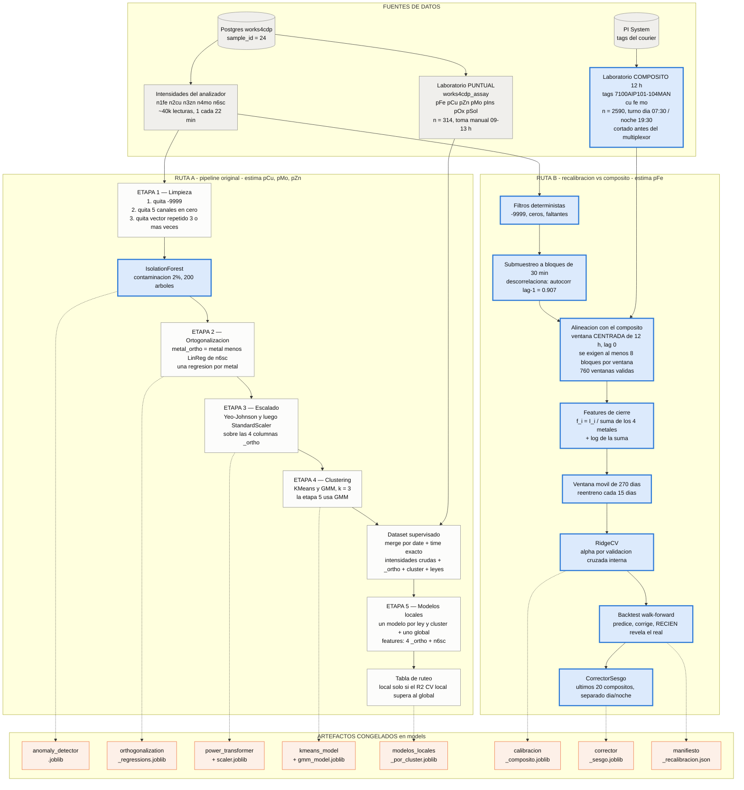
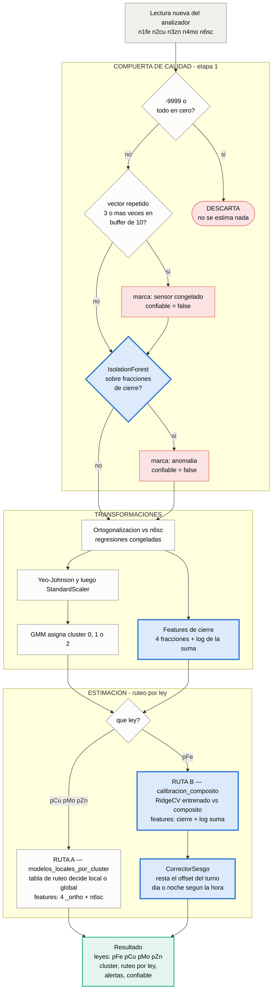
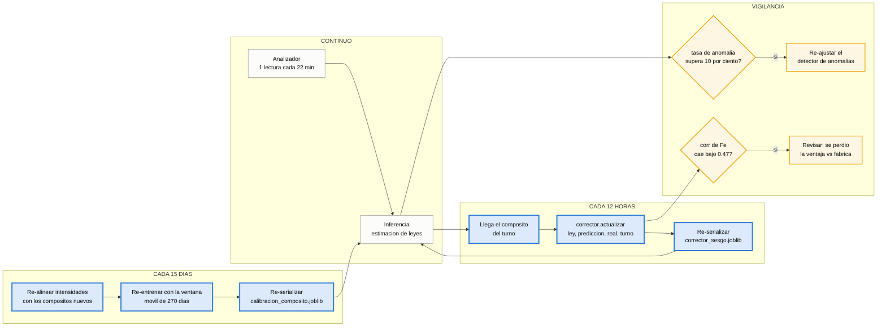

# Flujo del pipeline — estimación de leyes en concentrado de cobre

Diagramas del pipeline **después** de la recalibración contra el compósito de 12 h
(celda 10). Los bloques marcados con borde grueso azul son los cuatro cambios
introducidos; el resto es el pipeline original.

Fuente de verdad del código:

| Etapa | Módulo |
|---|---|
| 1 limpieza | `src/pipeline/limpieza.py` |
| 2 ortogonalización | `src/pipeline/ortogonalizacion.py` |
| 3 escalado | `src/pipeline/escalado.py` |
| 4 clustering | `src/pipeline/clustering.py` |
| 5 modelos locales | `src/pipeline/modelos.py` |
| 6 inferencia | `src/pipeline/inferencia.py` |
| features de cierre | `src/pipeline/features.py` |
| recalibración vs compósito | `src/pipeline/calibracion_composito.py` |

---

## 1. Flujo de entrenamiento / calibración

Dos rutas de calibración que conviven, porque las dos fuentes de laboratorio son
muestras físicamente distintas y cada ley se calibra con la que le conviene.



**Por qué dos rutas.** No es redundancia: el backtest walk-forward midió que la
recalibración contra el compósito **mejora Fe pero empeora Cu**.

| ley | antes | recalibrado | fábrica | techo | decisión |
|---|---|---|---|---|---|
| pFe | 0.278 | **0.508** | 0.470 | 0.743 | ruta B |
| pCu | 0.505 | 0.389 | 0.517 | 0.634 | ruta A |
| pMo | 0.958 | 0.951 | 0.948 | 0.961 | ruta A |

Cu se calibra mejor con la muestra puntual porque está emparejada al instante
exacto de una lectura; para cobre esa señal es más limpia que el promedio de una
ventana de 12 h. Mo ya está en el techo de información del sistema.

---

## 2. Flujo de inferencia en producción



**Detalle del ruteo.** `pFe` se salta por completo la tabla de ruteo local/global
y va al modelo recalibrado; las otras tres leyes conservan el comportamiento
original. El campo `ruteo` de la salida lo deja explícito: `composito` para Fe,
`local` o `global` para el resto.

**Detalle de la compuerta.** El IsolationForest ahora evalúa en el espacio de
fracciones de cierre, no de intensidades absolutas. El artefacto lleva la marca
`_robusto` y la inferencia la lee para transformar la lectura antes de evaluarla:
aplicar un detector de cierre a intensidades absolutas marcaría todo como anomalía.

---

## 3. Ciclo operativo

La ruta B **no es un modelo congelado**: tiene un ciclo de mantenimiento que hay
que sostener, porque el instrumento pierde ~22% de cuentas al año.



**El paso de 15 días es obligatorio.** La ventana móvil es justamente lo que le da
a Fe el 0.508; con una ventana vieja el modelo vuelve al problema original de
aprender la deriva en vez de la química.

---

## Reproducción

```bash
pixi run python notebooks/10_recalibracion_composito.py --solo-backtest   # evaluar sin escribir
pixi run python notebooks/10_recalibracion_composito.py                   # aplicar los 4 cambios
pixi run python notebooks/11_figuras_resultados.py                        # figuras y tabla
```

El manifiesto `models/manifiesto_recalibracion.json` guarda los SHA-256 de las
entradas, todos los parámetros, las versiones de las librerías y las métricas
obtenidas, de modo que cualquier corrida se puede auditar contra la que produjo
los resultados de la tesis.
